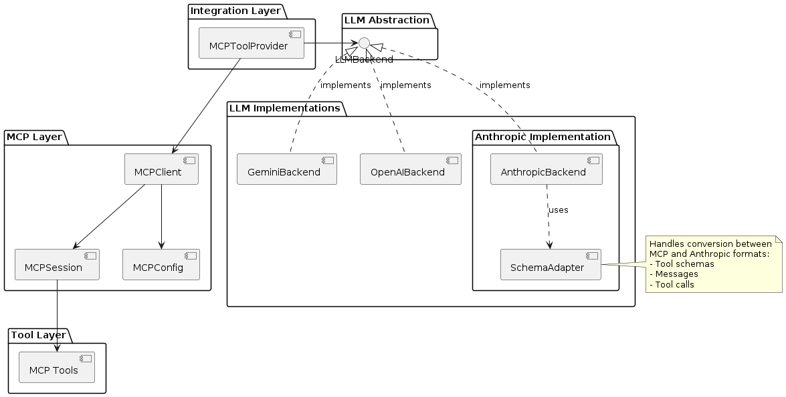

# Agentical: MCP-Compliant LLM Integration Framework

A robust Python framework for integrating Large Language Models (LLMs) with tools using the Model Context Protocol (MCP). This implementation provides a clean, type-safe, and maintainable way to connect LLMs with external tools and data sources.

## Features

- 🔌 MCP Protocol Integration
- 🚀 Async/Await First Design
- 🛠️ Modular LLM Backend Support (OpenAI, Gemini)
- 🎯 Type-Safe Tool Integration
- 🔍 Comprehensive Error Handling
- 🧹 Automatic Resource Management with AsyncExitStack
- 🔒 Robust Configuration Validation
- 🎮 Interactive Server Selection
- 📦 Clean Separation of Concerns

## Quick Start

### Installation

```bash
# Create and activate virtual environment
python -m venv .venv
source .venv/bin/activate  # Linux/Mac
# or
.venv\Scripts\activate  # Windows

# Install dependencies
pip install -r requirements.txt
```

### Basic Usage

1. Configure your environment:
   ```bash
   # .env file
   # Set the API key for your chosen LLM backend
   OPENAI_API_KEY=your_openai_key  # If using OpenAI backend
   # or
   GEMINI_API_KEY=your_gemini_key  # If using Gemini backend
   
   # Optional LLM configuration
   OPENAI_MODEL=gpt-4-turbo-preview  # Default model for OpenAI
   GEMINI_MODEL=gemini-pro          # Default model for Gemini
   ```

2. Set up your MCP configuration in `config.json`:
   ```json
   {
       "terminal-server": {
           "command": "python",
           "args": ["server/terminal_server.py"],
           "env": {
               "WORKSPACE_DIR": "/path/to/workspace"
           }
       },
       "filesystem-server": {
           "command": "python",
           "args": ["server/fs_server.py"],
           "env": {
               "WORKSPACE_DIR": "/path/to/workspace"
           }
       },
       "weather-server": {
           "command": "python",
           "args": ["server/weather_server.py"],
           "env": {
               "OPENWEATHERMAP_API_KEY": "your-api-key-here"
           }
       }
   }
   ```

3. Choose and use your LLM backend:
   ```python
   # Choose ONE backend to import:
   from openai_backend.openai_chat import OpenAIBackend    # For OpenAI
   # or
   from gemini_backend.gemini_chat import GeminiBackend    # For Gemini
   
   from agentical.integration.mcp import MCPToolProvider
   from typing import Dict, Any
   from mcp.types import CallToolResult
   
   async def main():
       try:
           # Initialize your chosen backend
           llm_backend = OpenAIBackend()    # If using OpenAI
           # or
           # llm_backend = GeminiBackend()  # If using Gemini
           
           provider = MCPToolProvider(llm_backend=llm_backend)
           
           # Load MCP server configuration
           provider.available_servers = MCPToolProvider.load_mcp_config("config.json")
           
           # Connect to server (with interactive selection)
           server_name = await provider.interactive_server_selection()
           await provider.mcp_connect(server_name)
           
           # Process queries
           response = await provider.process_query("What files are in the current directory?")
           print(response)
           
       except Exception as e:
           print(f"Error: {str(e)}")
       finally:
           # Ensure proper cleanup
           await provider.cleanup()
   
   if __name__ == "__main__":
       import asyncio
       asyncio.run(main())
   ```

## Architecture

The framework follows a clean, layered architecture with compile-time LLM backend selection:

```
┌─────────────────┐
│  Integration    │ MCPToolProvider coordinates between layers
├─────────────────┤
│    LLM Layer    │ Backend chosen at compile time (OpenAI/Gemini)
├─────────────────┤
│    MCP Layer    │ Standard MCP protocol implementation
├─────────────────┤
│   Tool Layer    │ External tools and data sources
└─────────────────┘
```

For a more detailed view of the system architecture and component relationships, see the [Component Diagram](docs/core-components.puml) ([View Image](docs/core-components.png)).



### Key Components

- **MCPToolProvider**: Main facade coordinating LLM and MCP interactions
  - Handles server selection and connection
  - Manages resource lifecycle with AsyncExitStack
  - Provides clean error handling and validation

- **LLMBackend**: Abstract interface for LLM implementations
  - Type-safe tool integration
  - Async query processing
  - Pluggable provider support

- **MCPSession**: Handles MCP server connections
  - Async tool execution
  - Resource cleanup guarantees
  - Error handling

## Configuration

The framework connects to MCP-compliant servers, which are configured through a JSON-based configuration system. Each server entry specifies how to launch an MCP-compliant server:

```json
{
    "terminal-server": {
        "command": "python",
        "args": ["server/terminal_server.py"],
        "env": {
            "WORKSPACE_DIR": "/path/to/workspace"
        }
    },
    "filesystem-server": {
        "command": "python",
        "args": ["server/fs_server.py"],
        "env": {
            "WORKSPACE_DIR": "/path/to/workspace"
        }
    },
    "weather-server": {
        "command": "python",
        "args": ["server/weather_server.py"],
        "env": {
            "OPENWEATHERMAP_API_KEY": "your-api-key-here"
        }
    }
}
```

### Available MCP Servers

The framework includes several example MCP servers to demonstrate how easily new MCP-compliant tools can be developed. These serve as both useful tools and reference implementations for creating your own MCP servers.

#### Built-in Servers

#### Terminal Server
- **Purpose**: Execute shell commands in a controlled workspace
- **Tool**: `run_command`
- **Configuration**: 
  - `WORKSPACE_DIR`: Optional, defaults to `~/mcp/workspace`

#### Filesystem Server
- **Purpose**: Safe, cross-platform file operations
- **Tools**:
  - `read_file`: Read contents of a file
  - `write_file`: Write content to a file
  - `list_directory`: List contents of a directory
- **Configuration**:
  - `WORKSPACE_DIR`: Optional, defaults to `~/mcp/workspace`

#### Weather Server
- **Purpose**: Fetch current weather information
- **Tool**: `get_weather`
- **Configuration**:
  - `OPENWEATHERMAP_API_KEY`: Required, your OpenWeatherMap API key
- **Usage Example**:
  ```python
  # Get weather in Celsius (metric)
  response = await provider.process_query("What's the weather in London?")
  
  # Get weather in Fahrenheit (imperial)
  response = await provider.process_query("What's the temperature in New York in Fahrenheit?")
  ```

#### External MCP Servers

The framework can integrate with any MCP-compliant server without modification. The examples below demonstrate how to configure popular external MCP servers that can be used as-is, requiring only configuration changes in your `config.json`:

#### Knowledge Graph Server
```json
{
    "knowledge-graph": {
        "command": "npx",
        "args": ["-y", "@beanone/knowledge-graph"],
        "env": {
            "WORKSPACE_DIR": "/path/to/workspace"  // Optional
        }
    }
}
```

#### Brave Search Server
```json
{
    "brave-search": {
        "command": "npx",
        "args": ["-y", "@beanone/brave-search"],
        "env": {
            "BRAVE_API_KEY": "your-api-key-here"  // Required
        }
    }
}
```

#### Memory Server
```json
{
    "memory": {
        "command": "npx",
        "args": ["-y", "@beanone/memory"],
        "env": {
            "MEMORY_STORE_PATH": "/path/to/store"  // Optional
        }
    }
}
```

To integrate external servers:
1. Install the required packages (if using npm packages, ensure Node.js is installed)
2. Add the server configuration to your `config.json`
3. Set any required environment variables
4. The servers will be automatically available through the `MCPToolProvider`

Each server in the configuration must implement the Model Context Protocol. The configuration specifies:
- `command`: The command to launch the MCP server
- `args`: Arguments passed to the server command
- `env`: Optional environment variables for the server
- `working_dir`: Optional working directory for the server

### Environment Variables

- **LLM API Keys** (set based on your chosen backend)
  - `OPENAI_API_KEY`: Required if using OpenAI backend
  - `GEMINI_API_KEY`: Required if using Gemini backend

- **Server Configuration**
  - Custom variables can be specified in server configs under the `env` field

## Error Handling

The framework provides comprehensive error handling:

- **Configuration Validation**
  - Server configuration validation
  - API key verification
  - Type checking for all inputs

- **Connection Management**
  - Server connection error handling
  - Resource cleanup on failures
  - Automatic session management

- **Runtime Protection**
  - Tool execution error handling
  - Type-safe parameter validation
  - Resource cleanup guarantees

## Development

### Prerequisites

- Python 3.10+
- Virtual environment (venv)
- OpenAI API key (for OpenAI backend)
- Gemini API key (for Gemini backend)

### Setup Development Environment

```bash
# Clone repository
git clone <repository-url>
cd agentical

# Create and activate virtual environment
python -m venv .venv
source .venv/bin/activate

# Install development dependencies
pip install -r requirements-dev.txt
```

### Running Tests

```bash
# Run all tests
pytest

# Run specific test file
pytest tests/test_provider.py

# Run interactive tests
python test_openai.py  # For OpenAI backend
python test_gemini.py  # For Gemini backend
```

### Implementing New LLM Backends

1. Inherit from `LLMBackend` abstract base class
2. Implement required methods:
   - `process_query`: Handle query processing and tool execution
   - `convert_tools`: Convert MCP tools to LLM-specific format
3. Add proper error handling and resource management
4. Follow existing patterns in OpenAI/Gemini implementations

## Contributing

1. Fork the repository
2. Create a feature branch
3. Implement changes with tests
4. Ensure all tests pass
5. Create a Pull Request

## License

[MIT License](LICENSE)

## Acknowledgments

- Built on the [Model Context Protocol](https://modelcontextprotocol.io/)
- Uses the official [MCP Python SDK](https://github.com/modelcontextprotocol/python-sdk) 