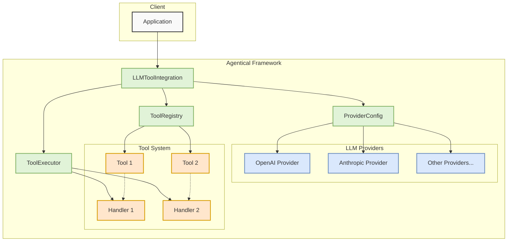
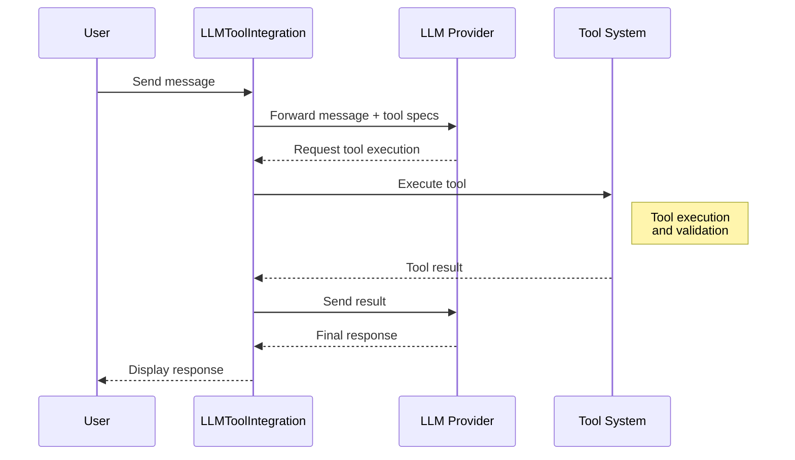

# Agentical

A simple, flexible framework for building tool-enabled AI agents in Python. Agentical provides a clean, type-safe interface for creating AI agents that can use tools and interact with various LLM providers.

[](https://opensource.org/licenses/MIT)
[](https://www.python.org/downloads/)
[](https://github.com/psf/black)

## Features

- 🔌 **LLM Integration**: Built-in support for OpenAI, Anthropic, and MCP, with an extensible provider system
- 🛠️ **Flexible Tool System**: Easy-to-use interface for creating and managing tools
- 🔒 **Type Safety**: Full type hints and runtime type checking with Pydantic
- 🧩 **Modular Design**: Easily extend with new providers and tools
- 🔄 **Async First**: Built for asynchronous operations from the ground up
- 📝 **Comprehensive Logging**: Detailed logging for debugging and monitoring
- 🧪 **Testing Support**: Extensive test utilities and mocking support

## Installation

```bash
# Basic installation (core functionality only)
pip install agentical

# With LLM support (OpenAI and Anthropic)
pip install agentical[llm]

# With MCP support
pip install agentical[mcp]

# With all providers
pip install agentical[all]

# With development tools
pip install agentical[dev]
```

## Quick Start

First, install Agentical with LLM support:
```bash
pip install agentical[llm]
```

1. Set up your environment variables:

```bash
# .env
OPENAI_API_KEY=your_openai_key
ANTHROPIC_API_KEY=your_anthropic_key
```

2. Create a tool-enabled agent:

```python
import os
from agentical import ToolRegistry, ToolExecutor, tool
from agentical.core import ProviderConfig
from agentical.providers.llm import LLMToolIntegration

# Define a simple tool
@tool(
    name="calculator",
    description="Performs basic arithmetic operations",
    parameters={
        "operation": "The operation to perform (add, subtract, multiply, divide)",
        "numbers": "List of numbers to operate on"
    }
)
def calculator(operation: str, numbers: list[float]) -> float:
    """A simple calculator tool that performs basic arithmetic."""
    if operation == "add":
        return sum(numbers)
    elif operation == "multiply":
        result = 1
        for num in numbers:
            result *= num
        return result
    elif operation == "subtract":
        if not numbers:
            return 0
        result = numbers[0]
        for num in numbers[1:]:
            result -= num
        return result
    elif operation == "divide":
        if not numbers:
            return 0
        result = numbers[0]
        for num in numbers[1:]:
            if num == 0:
                raise ValueError("Cannot divide by zero")
            result /= num
        return result
    else:
        raise ValueError(f"Unknown operation: {operation}")

def main():
    # Set up tool registry and executor
    registry = ToolRegistry()
    registry.register_tool(calculator)
    executor = ToolExecutor(registry)
    
    # Configure the LLM provider
    provider_config = ProviderConfig(
        api_key=os.environ["ANTHROPIC_API_KEY"],
        model="claude-3-sonnet-20240229"
    )
    
    # Create LLM integration
    integration = LLMToolIntegration(
        registry=registry,
        executor=executor,
        provider_config=provider_config,
        model_provider="anthropic"
    )
    
    # Run a conversation with tool support
    messages = [
        {
            "role": "system",
            "content": "You are a helpful assistant that can perform calculations."
        },
        {
            "role": "user",
            "content": "Can you multiply 23 and 45?"
        }
    ]
    
    # The run_conversation method is async, but we can run it in a sync context
    import asyncio
    response = asyncio.run(integration.run_conversation(messages))
    print(response)

if __name__ == "__main__":
    main()
```

This example demonstrates:
1. Creating and registering a tool
2. Setting up the tool executor
3. Configuring an LLM provider
4. Using `LLMToolIntegration` to combine tools with LLM capabilities

## Architecture



### Key Components

- **LLMToolIntegration**: Central component that orchestrates the interaction between LLMs and tools
- **ProviderConfig**: Manages configuration for different LLM providers (API keys, models, etc.)
- **ToolRegistry**: Maintains the collection of available tools and their specifications
- **ToolExecutor**: Handles the execution of tools through their respective handlers
- **Tools**: Individual capabilities that can be invoked by the LLM
- **Tool Handlers**: Implementation of tool logic and execution

### Data Flow



### Key Interactions

1. User sends a message to the LLMToolIntegration
2. Message is forwarded to the LLM provider along with available tool specifications
3. LLM decides to use a tool and requests execution
4. Tool request is validated against the registry
5. Tool is executed through its handler
6. Results are sent back to the LLM for final response generation
7. Final response is displayed to the user

## Development

### Setup

1. Clone the repository:
```bash
git clone https://github.com/yourusername/agentical.git
cd agentical
```

2. Create a virtual environment:
```bash
python -m venv .venv
source .venv/bin/activate  # Linux/Mac
# or
.venv\Scripts\activate  # Windows
```

3. Install development dependencies:
```bash
pip install -e ".[dev]"
```

### Testing

```bash
# Run all tests
./run_tests.sh

# Run only integration tests
./run_integration_tests.sh

# Run with coverage
pytest --cov=agentical
```

### Code Quality

The project uses several tools to maintain code quality:

- **Black**: Code formatting
- **Ruff**: Linting and static analysis
- **MyPy**: Type checking
- **Pre-commit**: Automated checks before commits

Run the pre-commit hooks:
```bash
pre-commit run --all-files
```

## Contributing

1. Fork the repository
2. Create a feature branch
3. Make your changes
4. Run tests and linting
5. Submit a pull request

Please ensure your PR:
- Includes tests for new features
- Updates documentation as needed
- Follows the project's code style
- Includes a clear description of changes

## License

This project is licensed under the MIT License - see the [LICENSE](LICENSE) file for details.

## Acknowledgments

- Thanks to all contributors
- Inspired by various agent frameworks in the Python ecosystem 

## Provider Support

### MCP Integration

Agentical provides first-class support for MCP (Mission Control Platform). Here's how to use it:

1. Set up MCP configuration:

```python
from agentical import ToolRegistry, ToolExecutor
from agentical.providers.mcp import MCPProvider, MCPConfig

# Configure MCP
mcp_config = MCPConfig(
    api_key="your_mcp_api_key",
    model="mcp-default-model"  # or your chosen model
)

# Create MCP provider
provider = MCPProvider(config=mcp_config)

# Set up tool registry and executor as usual
registry = ToolRegistry()
executor = ToolExecutor(registry)

# Register your tools
@tool(
    name="example_tool",
    description="Example tool for MCP",
    parameters={
        "param1": "Description of parameter 1",
        "param2": "Description of parameter 2"
    }
)
async def example_tool(param1: str, param2: int) -> dict:
    return {"result": f"Processed {param1} with {param2}"}

registry.register_tool(example_tool)

# Create integration
integration = provider.create_integration(registry=registry, executor=executor)

# Use the integration
response = await integration.run_conversation([
    {"role": "user", "content": "Use the example tool with param1='test' and param2=42"}
])
```

2. Using MCP-specific features:

```python
from agentical.providers.mcp import MCPToolDecorator

# Use MCP-specific tool decorator for enhanced functionality
@MCPToolDecorator(
    name="mcp_tool",
    description="MCP-specific tool example",
    mcp_specific_param="value"
)
async def mcp_specific_tool(param: str) -> dict:
    return {"mcp_result": param}

# Register MCP-specific tools
registry.register_tool(mcp_specific_tool)
```

3. Advanced MCP Configuration:

```python
from agentical.providers.mcp import MCPConfig, MCPFeatures

# Configure advanced MCP features
config = MCPConfig(
    api_key="your_mcp_api_key",
    model="mcp-default-model",
    features=MCPFeatures(
        enable_streaming=True,
        enable_tool_choice=True,
        custom_handlers=True
    ),
    timeout=30,
    max_retries=3
)
```

4. Error Handling:

```python
from agentical.providers.mcp import MCPError, MCPTimeoutError

try:
    response = await integration.run_conversation(messages)
except MCPTimeoutError:
    print("MCP request timed out")
except MCPError as e:
    print(f"MCP error occurred: {e}")
``` 