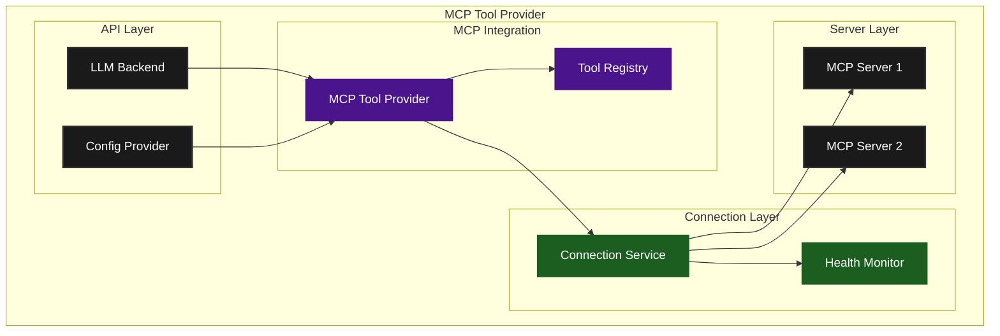
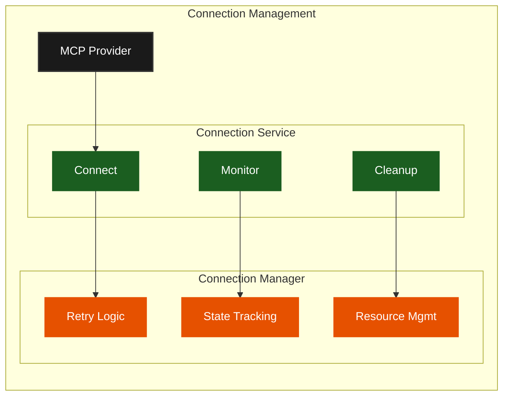
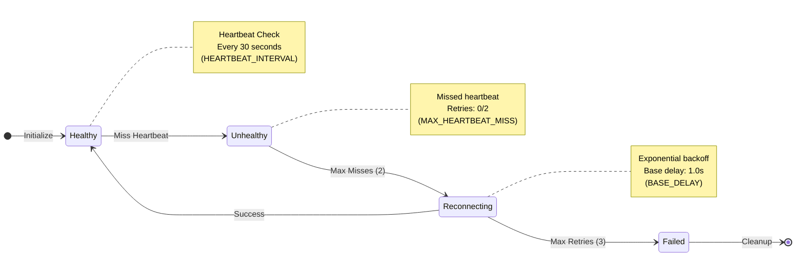
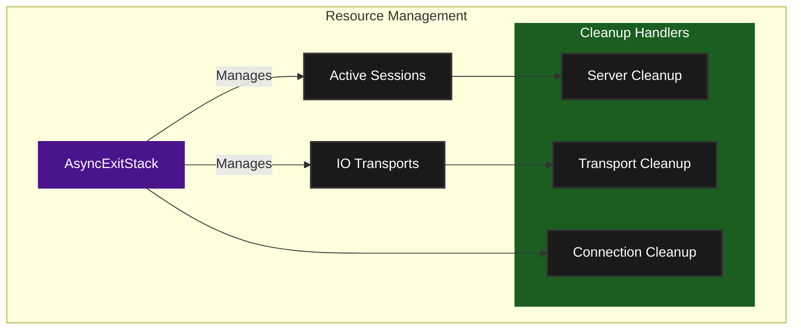
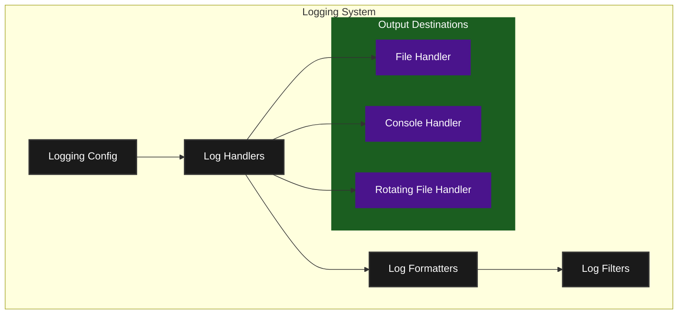
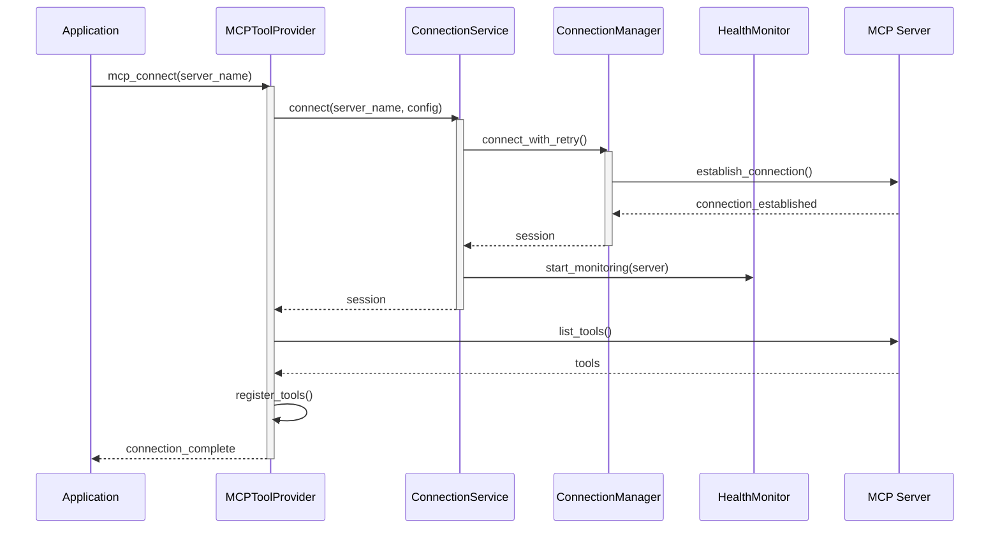

# Provider Architecture

## Table of Contents
- [Overview](#overview)
- [Core Components](#core-components)
  - [MCPToolProvider](#mcptoolprovider)
  - [Connection Management](#connection-management)
  - [Health Monitoring](#health-monitoring)
  - [Resource Management](#resource-management)
  - [Logging System](#logging-system)
- [Implementation Details](#implementation-details)
  - [Connection Service](#connection-service)
  - [Connection Manager](#connection-manager)
  - [Tool Registry](#tool-registry)

## Overview

The MCP (Machine Control Protocol) Tool Provider system in Agentical is designed to integrate LLM backends with external tools through a robust, fault-tolerant connection management system. The architecture follows a layered approach with clear separation of concerns.



## Core Components

### MCPToolProvider

The main facade that integrates LLMs with MCP tools. Key responsibilities:

```python
class MCPToolProvider:
    """Main facade for integrating LLMs with MCP tools."""

    def __init__(
        self,
        llm_backend: LLMBackend,
        config_provider: Optional[MCPConfigProvider] = None,
        server_configs: Optional[Dict[str, ServerConfig]] = None
    ):
        self.exit_stack = AsyncExitStack()
        self.connection_service = MCPConnectionService(self.exit_stack)
        self.tool_registry = ToolRegistry()
        self.llm_backend = llm_backend
```

Key features:
- Server connection management
- Tool discovery and registration
- Query processing with LLM integration
- Resource cleanup and management

### Connection Management

The connection system manages server connections, health monitoring, and resource lifecycle:



### Health Monitoring

The health monitoring system ensures reliable server connections through regular heartbeat checks and automatic recovery:



Features:
- Regular heartbeat checks (every 30 seconds)
- Configurable miss tolerance (default: 2)
- Automatic reconnection with exponential backoff
- Maximum retry attempts (default: 3)
- Proper cleanup on failure

### Resource Management



Key features:
- Proper async resource management
- Ordered cleanup
- Connection state tracking
- Transport management
- Session lifecycle management

### Logging System

The logging system provides comprehensive observability across the MCP Tool Provider:



Key features:
- Structured logging with timestamps and log levels
- Configurable log rotation
- Multiple output destinations (file, console)
- Log message sanitization
- Contextual logging with correlation IDs

Implementation details:
```python
def setup_logging(level: int | None = None, log_dir: str | None = None):
    """Configure logging for the MCP Tool Provider."""

    # Set up basic configuration
    logging.basicConfig(
        level=level or logging.INFO,
        format='%(asctime)s - %(name)s - %(levelname)s - %(message)s'
    )

    # Add file handler if log directory specified
    if log_dir:
        file_handler = RotatingFileHandler(
            filename=os.path.join(log_dir, 'mcp.log'),
            maxBytes=10*1024*1024,  # 10MB
            backupCount=5
        )
        logging.getLogger().addHandler(file_handler)
```

Logging levels:
- DEBUG: Detailed information for debugging
- INFO: General operational information
- WARNING: Warning conditions
- ERROR: Error conditions
- CRITICAL: Critical conditions

## Implementation Details

### Connection Service

Provides high-level connection management with:
- Health monitoring
- Automatic reconnection
- Resource cleanup
- Session management

```python
class MCPConnectionService(ServerReconnector, ServerCleanupHandler):
    """Unified service for managing MCP server connections and health."""

    HEARTBEAT_INTERVAL = 30  # seconds
    MAX_HEARTBEAT_MISS = 2   # attempts before reconnection
```

Key responsibilities:
- Maintains server health status
- Schedules regular heartbeat checks
- Triggers reconnection on failures
- Manages cleanup on permanent failures

### Connection Manager

Handles low-level connection details:
- Connection establishment with retry
- Resource management



### Tool Registry

The tool registry manages the lifecycle of MCP tools:

```python
class ToolRegistry:
    """Manages the lifecycle of MCP tools."""

    def __init__(self):
        self.tools = {}

    def register_tool(self, tool: MCPTool):
        self.tools[tool.name] = tool

    def get_tool(self, name: str) -> Optional[MCPTool]:
        return self.tools.get(name)

    def validate_tool(self, tool: MCPTool) -> bool:
        # Implementation of tool validation logic
        return True

    def get_all_tools(self) -> Dict[str, MCPTool]:
        return self.tools
```

Key features:
- Tool registration and discovery
- Tool validation and schema management
- Tool lifecycle management
- Tool version tracking