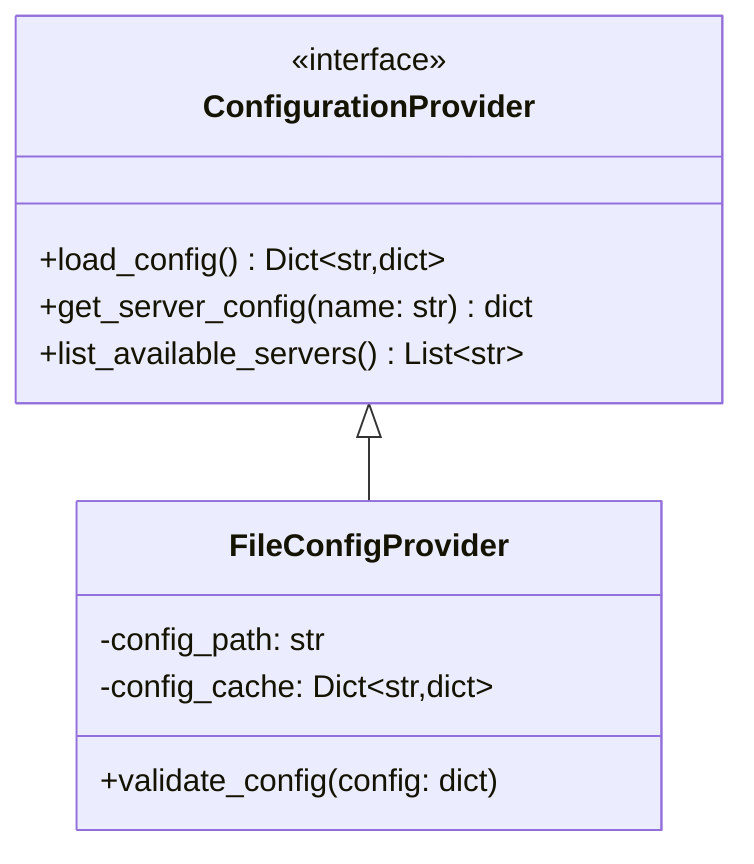
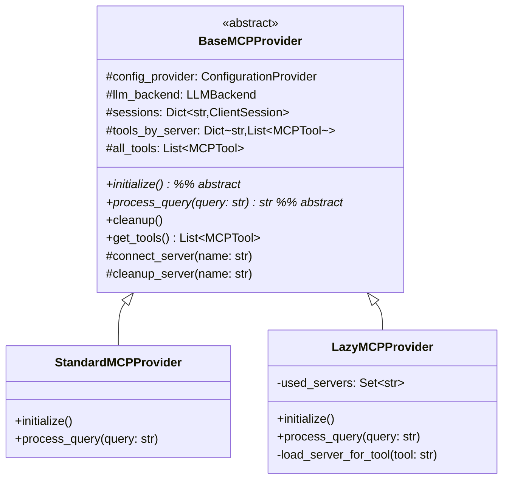

# MCPToolProvider Refactoring Plan

## Overview

This document outlines the plan for refactoring the MCPToolProvider to improve its flexibility and extensibility. The refactoring focuses on two main areas:

1. Configuration Management: Separating and abstracting configuration loading
2. Provider Abstraction: Supporting different provider implementations

## 1. Configuration Management Refactoring

### Current Structure
```
agentical/
├── api/
│   ├── __init__.py
│   └── llm_backend.py          # LLMBackend interface
├── mcp/
│   ├── __init__.py
│   └── provider.py             # Current MCPToolProvider implementation
├── *_backend/                  # Existing LLM backend implementations
└── tests/
    └── mcp/
        └── test_provider.py
```

### Target Structure (Phase 1)
```
agentical/
├── api/
│   ├── __init__.py
│   ├── llm_backend.py          # Existing LLMBackend interface
│   └── configurer.py           # New ConfigurationProvider interface
├── mcp/
│   ├── __init__.py
│   ├── provider.py             # Current MCPToolProvider (to be refactored)
│   └── file_configurer.py      # New FileConfigProvider implementation
├── *_backend/                  # Existing LLM backend implementations (unchanged)
└── tests/
    └── mcp/
        ├── test_provider.py
        └── test_file_configurer.py
```

### Target Architecture


### Implementation Steps

1. Create Configuration Provider Interface in `api/configurer.py`
   ```python
   from abc import ABC, abstractmethod
   from typing import Dict, List

   class ConfigurationProvider(ABC):
       """Interface for loading and managing MCP server configurations."""
       @abstractmethod
       async def load_config(self) -> Dict[str, dict]: ...
       
       @abstractmethod
       async def get_server_config(self, name: str) -> dict: ...
       
       @abstractmethod
       async def list_available_servers(self) -> List[str]: ...
   ```

2. Implement File-based Provider in `mcp/file_configurer.py`
   ```python
   from agentical.api.configurer import ConfigurationProvider

   class FileConfigProvider(ConfigurationProvider):
       def __init__(self, config_path: str):
           self.config_path = config_path
           self._config_cache: Dict[str, dict] = {}
           
       async def load_config(self) -> Dict[str, dict]:
           """Load and validate server configurations from file."""
           with open(self.config_path) as f:
               config = json.load(f)
           self.validate_config(config)
           self._config_cache = config
           return config
           
       def validate_config(self, config: dict) -> None:
           """Validate server configurations."""
           for server_name, server_config in config.items():
               if not isinstance(server_config, dict):
                   raise ValueError(f"Configuration for {server_name} must be a dictionary")
               if "command" not in server_config:
                   raise ValueError(f"Configuration for {server_name} must contain 'command' field")
               if "args" not in server_config or not isinstance(server_config["args"], list):
                   raise ValueError(f"Configuration for {server_name} must contain 'args' as a list")
   ```

## 2. Provider Abstraction

### Target Structure (Phase 2)
```
agentical/
├── api/
│   ├── __init__.py
│   ├── llm_backend.py          # Existing LLMBackend interface
│   ├── configurer.py           # From Phase 1
│   └── provider_base.py        # New BaseMCPProvider abstract base
├── mcp/
│   ├── __init__.py
│   ├── file_configurer.py      # From Phase 1
│   ├── standard_provider.py    # New StandardMCPProvider implementation
│   └── lazy_provider.py        # New LazyMCPProvider implementation
├── *_backend/                  # Existing LLM backend implementations (unchanged)
└── tests/
    └── mcp/
        ├── test_file_configurer.py
        ├── test_standard_provider.py
        └── test_lazy_provider.py
```

### Target Architecture


### Implementation Steps

1. Create Base Provider Class in `api/provider_base.py`
   ```python
   from abc import ABC, abstractmethod
   from typing import Dict, List, Set
   from contextlib import AsyncExitStack
   
   from agentical.api.configurer import ConfigurationProvider
   from agentical.api.llm_backend import LLMBackend
   from mcp import ClientSession
   from mcp.types import Tool as MCPTool

   class BaseMCPProvider(ABC):
       """Abstract base class for MCP Tool Providers."""
       def __init__(self, config_provider: ConfigurationProvider, llm_backend: LLMBackend):
           self.config_provider = config_provider
           self.llm_backend = llm_backend
           self.sessions: Dict[str, ClientSession] = {}
           self.tools_by_server: Dict[str, List[MCPTool]] = {}
           self.all_tools: List[MCPTool] = []
           self.exit_stack = AsyncExitStack()
           
       @abstractmethod
       async def initialize(self) -> None:
           """Initialize the provider and establish connections."""
           pass
           
       @abstractmethod
       async def process_query(self, query: str) -> str:
           """Process a user query using available tools."""
           pass
           
       async def cleanup(self) -> None:
           """Clean up all resources."""
           await self.exit_stack.aclose()
           self.sessions.clear()
           self.tools_by_server.clear()
           self.all_tools.clear()
           
       def get_tools(self) -> List[MCPTool]:
           """Get all available tools."""
           return self.all_tools
           
       async def _connect_server(self, name: str) -> None:
           """Connect to a server and load its tools."""
           if name in self.sessions:
               return
               
           config = await self.config_provider.get_server_config(name)
           # Current connection logic here
   ```

2. Implement Standard Provider in `mcp/standard_provider.py`
   ```python
   from agentical.api.provider_base import BaseMCPProvider

   class StandardMCPProvider(BaseMCPProvider):
       """Provider that connects to all servers at startup."""
       async def initialize(self) -> None:
           config = await self.config_provider.load_config()
           for server_name in config:
               await self._connect_server(server_name)
               
       async def process_query(self, query: str) -> str:
           # Current query processing logic
   ```

3. Implement Lazy Provider in `mcp/lazy_provider.py`
   ```python
   from agentical.api.provider_base import BaseMCPProvider

   class LazyMCPProvider(BaseMCPProvider):
       """Provider that connects to servers only when needed."""
       def __init__(self, config_provider: ConfigurationProvider, llm_backend: LLMBackend):
           super().__init__(config_provider, llm_backend)
           self.used_servers: Set[str] = set()
           
       async def initialize(self) -> None:
           """Lazy initialization - no immediate connections."""
           await self.config_provider.load_config()
           
       async def process_query(self, query: str) -> str:
           # Current query processing logic with lazy loading
           
       async def _load_server_for_tool(self, tool_name: str) -> None:
           """Load the server containing a specific tool."""
           if tool_name in self.all_tools:
               return
               
           config = await self.config_provider.load_config()
           for server_name in config:
               if server_name not in self.used_servers:
                   await self._connect_server(server_name)
                   self.used_servers.add(server_name)
                   if tool_name in [t.name for t in self.tools_by_server[server_name]]:
                       break
   ```

## Migration Strategy

1. Phase 1: Configuration Management
   ```mermaid
   graph TD
       A[Current Config in MCPToolProvider] -->|Step 1| B[Create ConfigurationProvider]
       B -->|Step 2| C[Implement FileConfigProvider]
       C -->|Step 3| D[Update Tests]
   ```

2. Phase 2: Provider Abstraction
   ```mermaid
   graph TD
       A[Current MCPToolProvider] -->|Step 1| B[Create BaseMCPProvider]
       B -->|Step 2| C[Implement StandardMCPProvider]
       C -->|Step 3| D[Implement LazyMCPProvider]
       D -->|Step 4| E[Update Tests]
   ```

## Testing Strategy

1. Configuration Tests
   - Unit tests for ConfigurationProvider interface
   - Integration tests for FileConfigProvider
   - Error handling and validation tests

2. Provider Tests
   - Unit tests for BaseMCPProvider
   - Integration tests for StandardMCPProvider
   - Integration tests for LazyMCPProvider
   - Connection handling tests
   - Resource cleanup tests

## Success Criteria

1. All tests pass with good coverage
2. No functionality regression
3. Clean separation of configuration and provider logic
4. Easy to add new provider implementations
5. Improved error handling and logging
6. Clear documentation and examples

## Timeline

1. Phase 1: Configuration Management (1 week)
   - Day 1-2: Interface design
   - Day 3-4: File provider implementation
   - Day 5: Discovery provider implementation

2. Phase 2: Provider Abstraction (1 week)
   - Day 1-2: Interface extraction
   - Day 3-4: Standard provider implementation
   - Day 5: Lazy loading implementation

3. Phase 3: Testing and Documentation (3 days)
   - Day 1: Unit tests
   - Day 2: Integration tests
   - Day 3: Documentation updates

## Future Considerations

1. Configuration Enhancements
   - Remote configuration sources
   - Configuration versioning
   - Encrypted configurations
   - Configuration templates

2. Provider Enhancements
   - Distributed provider implementation
   - Cross-process tool sharing
   - Advanced caching strategies
   - Predictive server loading 